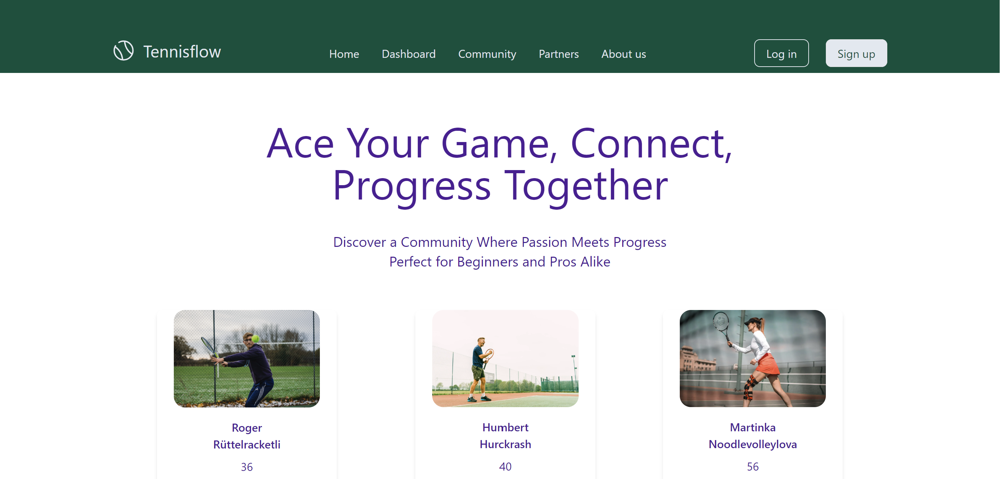
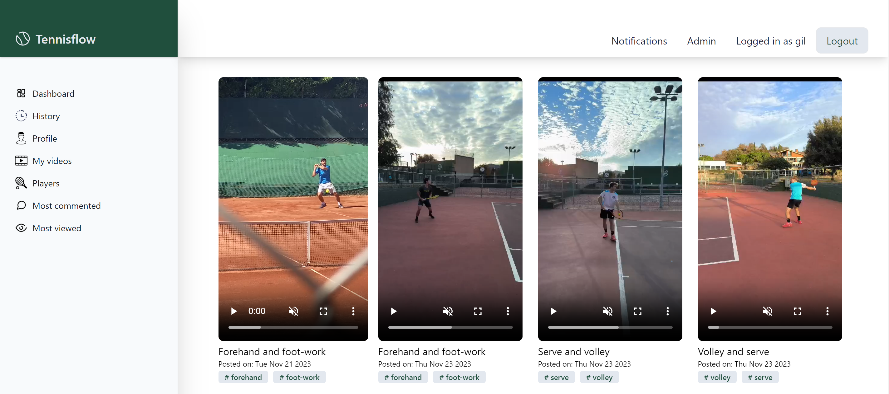

# Tennisflow

**Tennisflow** is a web application designed for tennis enthusiasts to share and receive feedback on tennis-related videos. Users can upload their tennis videos, engage with the community through comments, and personalize their profiles with profile photos and additional videos. The application seamlessly integrates with the Cloudinary API for efficient media 

Deployed version on fly.io : https://tennisflow.fly.dev

## Motivation

Tennis is widely recognized as the most popular individual sport in the world and it is played by millions of fans. However, learning, practicing and be able to afford this sport is not so easy. Expensive courts and the difficulty to find hitting partners might give you a hard time. Tennisflow aims to solve these issues by establishing a collaborative community ( akin to stackoverflow  ) where users support to one another, offering valuable personalized feedback and facilitating free improvement from any location. The ultimate aim is to bridge existing gaps and surpass financial hurdles, making learning tennis more accessible to all fans

## Technologies used

**Client:** Next.js, React, TypeScript, Tailwind

**Server:** Node.js, Migrations, PostgreSQL

## Screenshots

### Landing page



### Dashboard



## Setup guide
To run this project locally, the following steps are needed:
1. Clone this repo on your local machine and connect to your GitHub account
2. Download and install PostgreSQL (if not installed yet).
- https://www.postgresql.org/download/

3. Create a User and a Database for the project

4. Create a copy of the `.env.example` and name it `.env` on the root of the project and modify it with your PostgreSQL credentials. The file should include these four environment variables:

- PGHOST=localhost
- PGDATABASE=\<YOUR_POSTGRES_DATABASE>
- PGUSERNAME=\<YOUR_POSTGRES_USERNAME>
- PGPASSWORD=\<YOUR_POSTGRES_PASSWORD>
5. Create a Cloudinary account and use the credentials for Image Uploads.
6. Add the next environment variables to your .env file
- BASE_URL=\<YOUR_API_URL>
- CSRF_SECRET=\<CRSF_SALT_KEY>
7. Install the dependencies
```bash
$ pnpm
```
8. Install dotenv-cli globally with:
```bash
$ pnpm global add dotenv-cli
